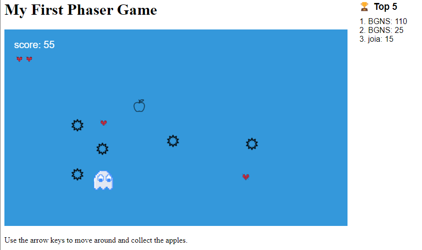

# spikes and ghosts
 game made by phaser 3 and JS

[tutorial](https://www.lessmilk.com/phaser-game-tutorial/)

Ideia pós tutorial:

// jogador tem 3 vidas. A cada vez que ele pega uma maçã, tem uma chance de 1 em 10 de aparecer um coração pra recuperar vida. Cada spike tira 5 pontos e 1 coração. Ao final, o score do player vai para um ranking.

Como rodar no seu navegador 0.1
Acesse: https://bgns42.github.io/spikes-and-ghosts/

ou

- Abra o diretório que salvou a pasta do jogo com o terminal.
- Digite `python -m http.server 888`
- acesse http://localhost:8888/ em seu navegador

*** deve ter pre requisitos antes, com instalar o Python

## Próximos passos
- efeitos sonoros;
- ranking unificado